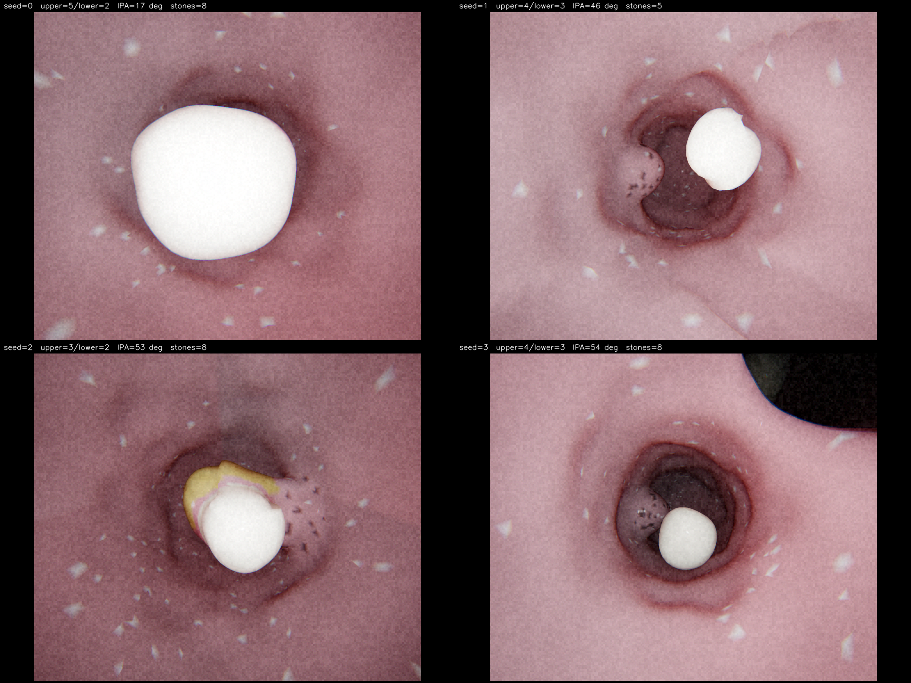

# endonav-sim

A procedural seeded simulator of robotic ureteroscopy. Every kidney is a unique, anatomically-grounded pelvicalyceal tree, populated with realistic kidney stones, viewed through a flexible ureteroscope with honest robotic dynamics — encoder noise, tendon-sheath hysteresis, buckling, dead-reckoning drift. Built for closed-loop autonomy research where you need to evaluate a controller against many anatomies, not one canonical phantom. Runs at 60+ fps.



*Four kidneys generated from seeds 0–3. Each one has a different number of upper / lower pole calyces, a different lower-pole infundibulopelvic angle (clinically critical for stone access), and a different stone configuration. Nothing is hard-coded — the numbers come from sampling distributions calibrated to the published anatomy literature.*

## Features

- **Seeded procedural anatomy.** Sampaio Type A1 pelvicalyceal trees with sampled lengths, radii, branch counts and angles. Per-kidney variation in total minor-calyx count (7–13), lower-pole infundibula count (3–7), infundibular geometry, **infundibulopelvic angle** (low IPA = clinically hard-to-reach lower pole), and ureter narrowing radii (UVJ + UPJ).
- **Kidney stones.** Composition rolled from global epidemiology (~80% calcium oxalate, 10% struvite, 9% uric acid, 1% cystine), sizes lognormal in 2–20 mm, location biased toward the gravity-dependent lower pole. Optional staghorn stones. Stones are carved into the wall mesh as proper geometry, painted with composition-specific colors, and queryable for capture.
- **Realistic ureteroscope interface.** `KidneySimulator.command(advance_mm, roll_deg, deflection_deg)` runs through a `ScopeDynamics` layer that simulates encoder quantization, deflection dead-zone, **tendon-sheath backlash hysteresis**, multiplicative noise, **shaft buckling** when an advance is rejected by the wall, retraction slip, and a separately-integrated **dead-reckoned pose estimate**. Returns a `CommandFeedback` with everything a real robotic scope could plausibly report.
- **Stone capture.** `attempt_capture(ToolMode.BASKET | ToolMode.LASER)` simulates the two real treatment modes. Basket grabs whole stones up to 3.5 mm; laser fragments stones up to 15 mm into 2–6 pieces that have to be cleaned up afterwards — the clinical *find → fragment → basket* loop.
- **Coaxial endoscopic rendering.** EndoPBR-style coaxial point light, GGX/Cook–Torrance specular collapsed for L=V, wrap-around diffuse with warm SSS bleed, ACES filmic tonemap. Phantom-camera matched optics: 1024×768 at 4:3, 870×760 active region letterboxed, 2× SSAA, mild radial chromatic aberration, h264-style sensor noise. Mesh is procedurally displaced and painted with vascular streaks, Randall's plaque speckles, and cribriform dots.
- **60+ fps.** Voxel-SDF collision queries, KD-tree-pruned mesh build, opt-in depth readback. Bench reports ~250 fps and ~5 ms per frame on a single procedural kidney with stones.

## Quickstart

```python
from endonav_sim import (
    AnatomyParams,
    KidneySimulator,
    StoneParams,
    ToolMode,
)

sim = KidneySimulator(
    anatomy_params=AnatomyParams(seed=42),  # fresh kidney
    stone_params=StoneParams(seed=42),       # 1-8 stones with realistic distribution
    seed=42,                                  # noise / dynamics RNG
    realistic=True,                           # set False for clean kinematic mode
)

print(f"{sim.anatomy_meta.n_dead_ends} calyces, "
      f"IPA={sim.anatomy_meta.infundibulopelvic_angle_deg:.0f}°")
print(f"{len(sim.stones)} stones")

sim.reset()
out = sim.render(with_depth=False, with_stones_visible=False)
# out["rgb"]                  : (H, W, 3) uint8 endoscope frame
# out["pose"]                  : (4, 4) ground-truth camera-to-world (eval only)
# out["nearest_wall_mm"]       : noisy proprioceptive clearance estimate
# out["current_tree_node"]     : ground-truth segment id (eval only)
# out["stones_visible"]        : ground-truth visible-stone list (eval only)

fb = sim.command(advance_mm=1.5, roll_deg=10.0, deflection_deg=25.0)
# fb.actual_advance_mm / .actual_roll_deg / .actual_deflection_deg
# fb.contact_force_norm  (0..1, derived from clearance)
# fb.buckled             (True if the shaft bowed instead of moving)
# fb.collided            (True if both the move and the buckle were blocked)
# fb.wall_clearance_mm   (quantized + noisy proprioception)
# fb.tip_pose_estimate   (dead-reckoned pose; drifts from ground truth)

result = sim.attempt_capture(ToolMode.LASER)
# result.success / .stone_id / .fragments_produced / .failure_reason
```

## Validation grid


`scripts/validate_grid.py` renders nine canonical viewpoints — distal/iliac/UPJ ureter, the pelvis bifurcation, both major calyces, and three minor calyces — at the phantom-camera resolution. Each tile is a real `KidneySimulator.render()` output.

## Skeleton with stones


`scripts/visualize_skeleton.py --seed N --stones` plots the procedural skeleton in 3D (one color per anatomical region), overlaid on a translucent point cloud of the wall mesh, with stones drawn as composition-colored markers sized by radius.

## Performance

`scripts/bench_sim.py` is the regression gate. On a single procedural kidney (seed 2, 412k tris, 8 stones):

```
build:                    57 s          # one-time, mesh + SDF + colored displacement
frame loop (200 frames):
  command()      mean   0.23  p50   0.23  p99   0.33 ms
  render()       mean   3.57  p50   3.51  p99   5.69 ms
  total          mean   3.80  p50   3.73  p99   5.98 ms
  fps:            263.1
  60fps target:  PASS
```

## Install

Requires Python 3.10–3.12. Uses [uv](https://docs.astral.sh/uv/) for environment management.

```bash
git clone <this-repo> endonav-sim
cd endonav-sim
uv sync                          # production deps (numpy, scipy, opencv, moderngl, ...)
uv sync --extra dev              # + ruff, pytest
```

## Scripts

```bash
uv run python scripts/demo_procedural_sim.py    # 4 procedural kidneys -> artifacts/procedural_kidneys.png
uv run python scripts/bench_sim.py --seed 2     # perf + accuracy regression
uv run python scripts/visualize_skeleton.py     # 3D skeleton + stones overlay
uv run python scripts/validate_grid.py          # 3x3 anatomical viewpoint grid
uv run python scripts/validate_kinematics.py    # 3x4 roll/deflection grid + invariants
uv run python scripts/validate_flythrough.py    # MP4 fly-through of the entire DFS
```

All scripts write to `artifacts/` (gitignored). Committed reference images live in `docs/images/`.

## Layout

```
endonav_sim/
  anatomy.py     AnatomyParams + generate_anatomy (seeded Sampaio A1)
  stones.py      Stone, StoneParams, generate_stones (seeded epidemiology)
  skeleton.py    Per-segment 1mm centerline waypoints with tangents
  mesh_gen.py    KD-tree-pruned swept-sphere SDF, marching cubes
  sdf.py         VoxelSDF: trilinear interpolation collision queries
  collision.py   ClearanceField wrapping VoxelSDF
  texture.py     Vertex displacement, base + stone coloring
  dynamics.py    ScopeLimits, ScopeDynamics, CommandFeedback
  renderer.py    moderngl renderer, SSAA, two-pass coaxial + endoscope post
  simulator.py   KidneySimulator: command, render, attempt_capture, follow_skeleton
  shader/
    coaxial.{vert,frag}     EndoPBR-style coaxial BRDF
    postprocess.{vert,frag} Letterbox + chroma + h264 noise resolve
scripts/
  demo_procedural_sim.py    4-kidney preview
  bench_sim.py              Perf + clearance accuracy regression
  visualize_skeleton.py     3D skeleton + stones overlay
  validate_grid.py          3x3 anatomical viewpoint grid
  validate_kinematics.py    Roll/deflection invariants
  validate_flythrough.py    MP4 DFS fly-through
docs/images/                Committed reference images
```

## Dev

```bash
uv run ruff check endonav_sim scripts
uv run ruff format endonav_sim scripts
uv run python scripts/bench_sim.py --seed 2 --frames 200 --accuracy
```

## License

MIT — see [LICENSE](LICENSE).

## References

- **Anatomy**:
  [StatPearls — Anatomy of the Ureter](https://www.ncbi.nlm.nih.gov/books/NBK532980/);
  [Yamashita 2021 — Physiological narrowings in the upper urinary tract](https://pmc.ncbi.nlm.nih.gov/articles/PMC8096766/);
  [Soni 2018 — Pelvicalyceal morphology](https://pmc.ncbi.nlm.nih.gov/articles/PMC6595142/);
  [Kidney collecting system anatomy applied to endourology — narrative review 2024](https://pmc.ncbi.nlm.nih.gov/articles/PMC10953598/);
  [Elbahnasy — Lower caliceal stone clearance and infundibulopelvic anatomy](https://pubmed.ncbi.nlm.nih.gov/9474124/).
- **Stones**:
  [Kidney stone disease — Wikipedia](https://en.wikipedia.org/wiki/Kidney_stone_disease);
  [StatPearls — Renal Calculi](https://www.ncbi.nlm.nih.gov/books/NBK442014/);
  [Treatment of renal lower pole stones — review](https://pmc.ncbi.nlm.nih.gov/articles/PMC8691227/).
- **Ureteroscopes**:
  [Boston Scientific LithoVue specifications](https://www.bostonscientific.com/en-US/products/Ureteroscopes/LithoVue/specifications.html);
  [Single-use flexible ureteroscopes — pictorial review 2023](https://pmc.ncbi.nlm.nih.gov/articles/PMC10743947/);
  [Pietrow 2004 — Physical properties of flexible ureteroscopes (buckling pressures)](https://pubmed.ncbi.nlm.nih.gov/15253821/).
- **Robot dynamics**:
  [Robotic flexible ureteroscopy — current status review](https://pmc.ncbi.nlm.nih.gov/articles/PMC9448675/);
  [Wang 2015 — Tendon-sheath nonlinear friction modelling](https://www.sciencedirect.com/science/article/abs/pii/S0888327015000035);
  [Zhang 2017 — Mixed control scheme for flexible endoscopes](https://journals.sagepub.com/doi/10.1177/1729881417702506).
- **Rendering**: [EndoPBR](https://arxiv.org/abs/2502.20669) (arXiv 2502.20669, 2025); [NVIDIA GPU Gems Ch 16 — Subsurface Scattering](https://developer.nvidia.com/gpugems/gpugems/part-iii-materials/chapter-16-real-time-approximations-subsurface-scattering); Dey et al., MICCAI 2005.
