# endonav-sim

A procedural endoscopic simulator of a kidney collecting system, built as a testbed for autonomous ureteroscope navigation algorithms (junction detection, place recognition, DFS exploration). No CT scan required — the entire pelvicalyceal anatomy is generated procedurally and rendered with a coaxial lighting model derived from published endoscopic-rendering literature.

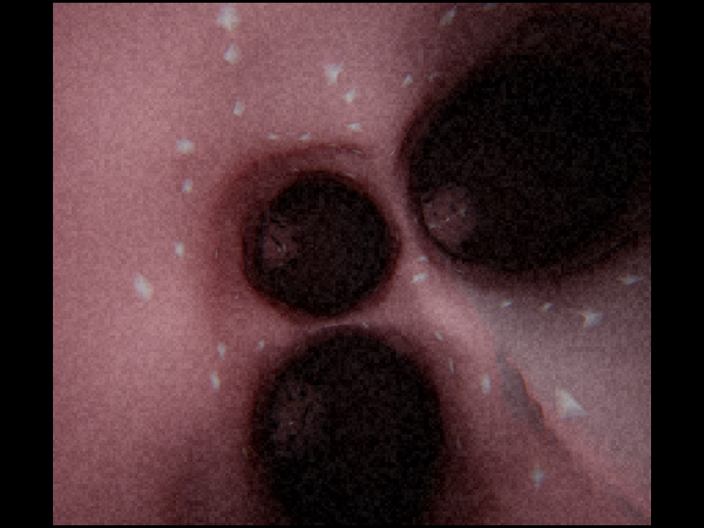

## What it does

- **Procedural anatomy.** A 19-node Sampaio Type A1 pelvicalyceal tree (S-curved ureter with three physiologic narrowings → broad renal pelvis → 2 major calyces → 6 minor calyces, each terminating in a papilla) is generated from a tree dictionary, swept with sphere SDFs, blended via smooth-min, carved with papilla domes via smooth-max, and meshed with marching cubes into a single watertight inner-wall mesh.
- **Mucosal detail.** Vertex displacement (3D value noise) creates the bumpy mucosal folds; per-vertex color noise creates vascular streaks; cribriform dark dots on the papillae and sparse Randall's plaque white speckles add the diagnostically distinctive features urologists look for.
- **EndoPBR-style lighting.** Coaxial point light at the camera, EndoPBR spotlight emission `cos^n(θ)/r²`, GGX/Cook-Torrance specular collapsed for the L=V case, wrap-around diffuse with warm SSS bleed for skin-like terminator softening, ACES filmic tonemap. References: [EndoPBR](https://arxiv.org/abs/2502.20669) (arXiv 2502.20669, 2025), [NVIDIA GPU Gems Ch 16](https://developer.nvidia.com/gpugems/gpugems/part-iii-materials/chapter-16-real-time-approximations-subsurface-scattering), Dey et al. MICCAI 2005.
- **Phantom-camera matched optics.** 1024×768 output at 4:3, with 870×760 active region letterboxed by black bars. 2× supersample AA, mild radial chromatic aberration, blocky h264-style sensor noise.
- **Ureteroscope kinematics.** `KidneySimulator` models a flexible ureteroscope (ROEN Surgical Zamenix R style) with 3 real DOFs: `advance` along the shaft, `roll` (incremental axial shaft rotation), and `deflection` (absolute single-plane tip bending). The shaft passively conforms to the lumen centerline; aiming is polar — roll picks the bending direction, deflection picks the bending amount. Rolling the shaft also rotates the rendered camera image, just like a real scope. Exposes `reset / render / command(advance_mm, roll_deg, deflection_deg) / follow_skeleton / get_skeleton`. `render()` returns RGB + metric depth + clearance + current tree node + progress. SDF-based collision detection prevents the camera from intruding on the wall.
- **Perception stack (RGB-only).** A separate `endonav_sim.perception` subpackage turns rendered frames into the signals an autonomy controller needs, with no access to depth/pose ground truth: `JunctionDetector` (adaptive dark-blob detection inside a circular aperture, classifies frames as junction/lumen/dead_end with temporal confirmation, returns blob centroids in roll-corrected polar coords), `PlaceRecognition` (DINOv2 ViT-S/14 + online VLAD with 32-cluster vocab, HSV-histogram fallback if torch is unavailable, de-rotates by cumulative roll before extraction so descriptors are roll-invariant), and `ProximityDetector` (3×3 brightness grid + Farneback optical-flow expansion for safety reflexes).

## Example renders

| Inside the upper major calyx | Inside a minor calyx with papilla |
|---|---|
|  | 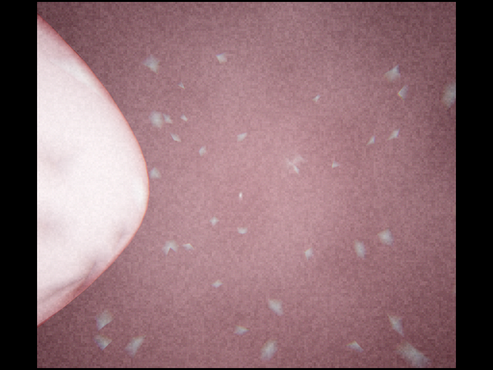 |

| Down the iliac ureter | Anatomy validation grid (3×3 viewpoints) |
|---|---|
| 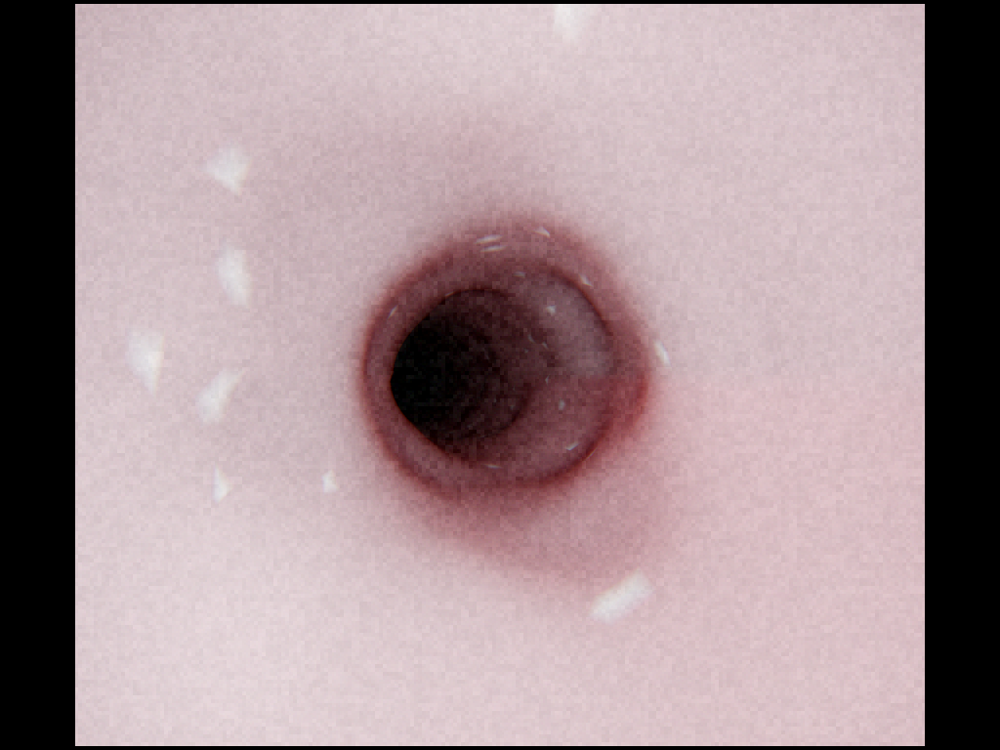 |  |

The grid shows nine canonical viewpoints from the validation suite — distal/iliac/UPJ ureter, the pelvis bifurcation, both major calyces, and three minor calyces. Each tile is a real `KidneySimulator.render()` output at the phantom-camera resolution.

### Skeleton
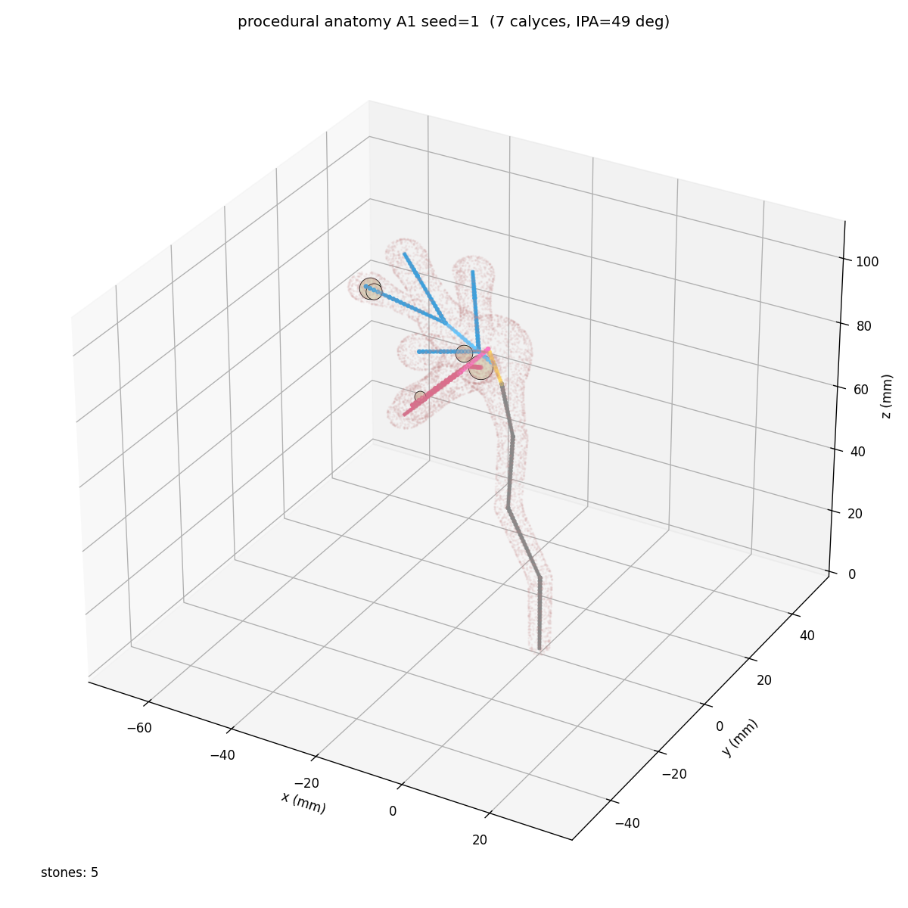

The 3D skeleton (one color per tree node) overlaid on a translucent point cloud of the wall mesh. Each calyx leaf has a small papilla blob carved into the back wall.

### Brightness validation
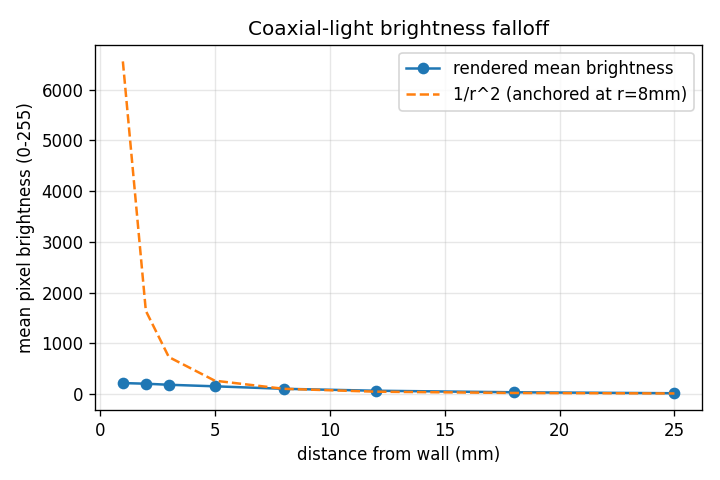

The central pixel patch over a flat-ish wall, sampled at distances 1–25 mm. The rendered curve (solid) tracks the analytic 1/r² reference (dashed) — confirming the inverse-square coaxial light is faithful and that brightness-based proximity perception modules will transfer sim→real.

### Junction detection
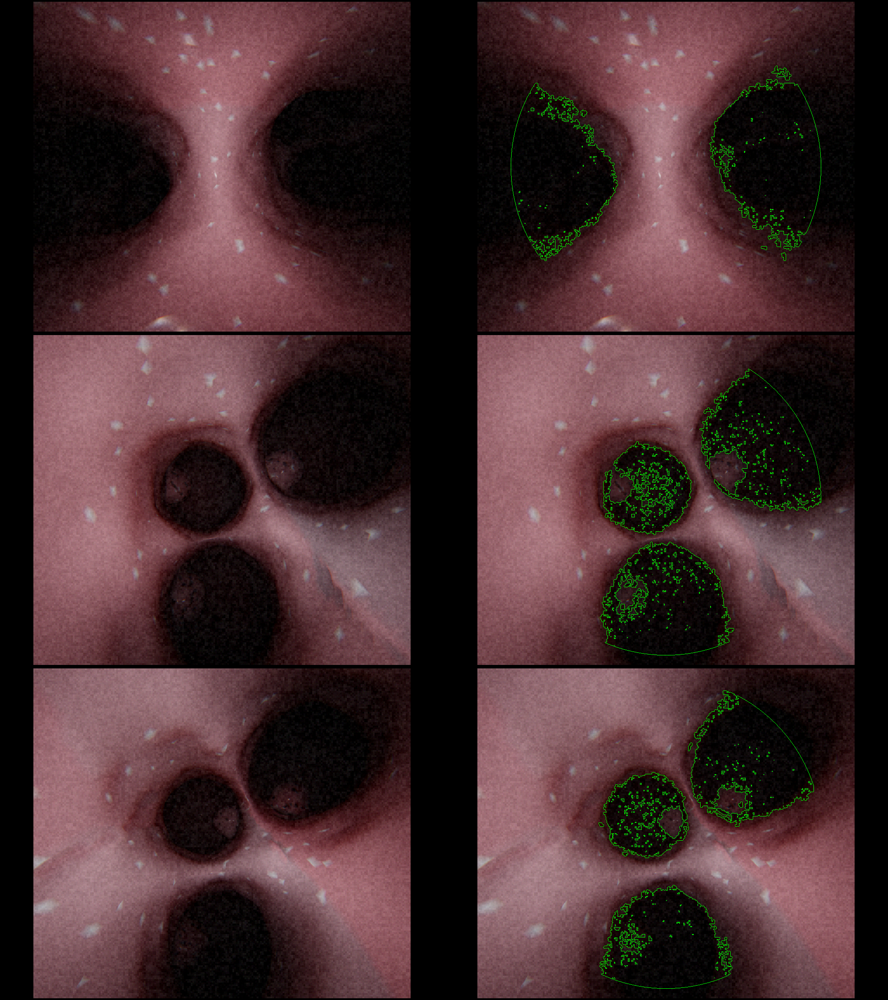

A simple dark-blob counter (placeholder for the real junction detector) at the three anatomical bifurcation levels:
- Pelvis: ≥2 dark openings (the two major calyces) ✓
- Upper major: ≥3 dark openings (the three minor infundibula) ✓
- Lower major: ≥3 dark openings ✓

### Perception stack validation

`scripts/validate_perception.py` exercises the full RGB-only perception subpackage end-to-end against the simulator and writes six PNGs to the repo root. With the `perception-dl` extra installed (DINOv2 backend) the latest run reports:

```
junctions+deadend      PASS   pelvis=2 blobs, major_upper=3 blobs, calyx=dead_end
place_recognition      PASS   diag=1.000  off=-0.048  sep=1.048   (DINOv2 + VLAD)
blob_polar             PASS   ground-truth angular errors 4.9°, 1.9°
roll_invariance        PASS   min cosine sim = 0.966 across 0/90/180/270°
```

| Pelvis bifurcation (2 blobs) | Upper-major trifurcation (3 blobs) | Minor calyx dead end (0 blobs) |
|---|---|---|
| 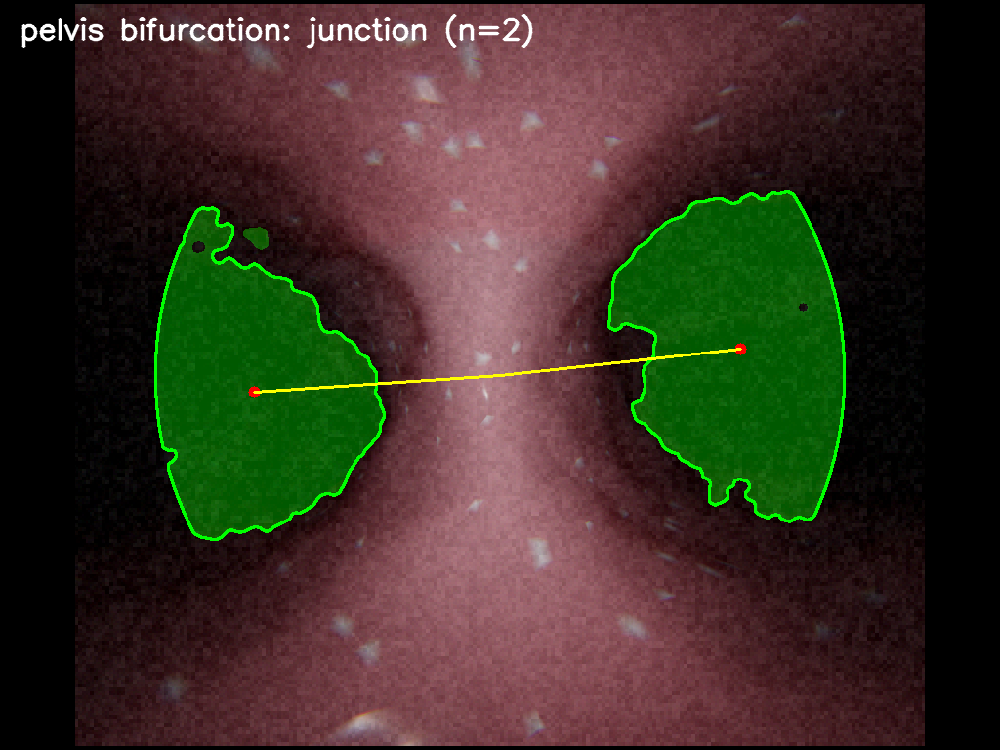 | 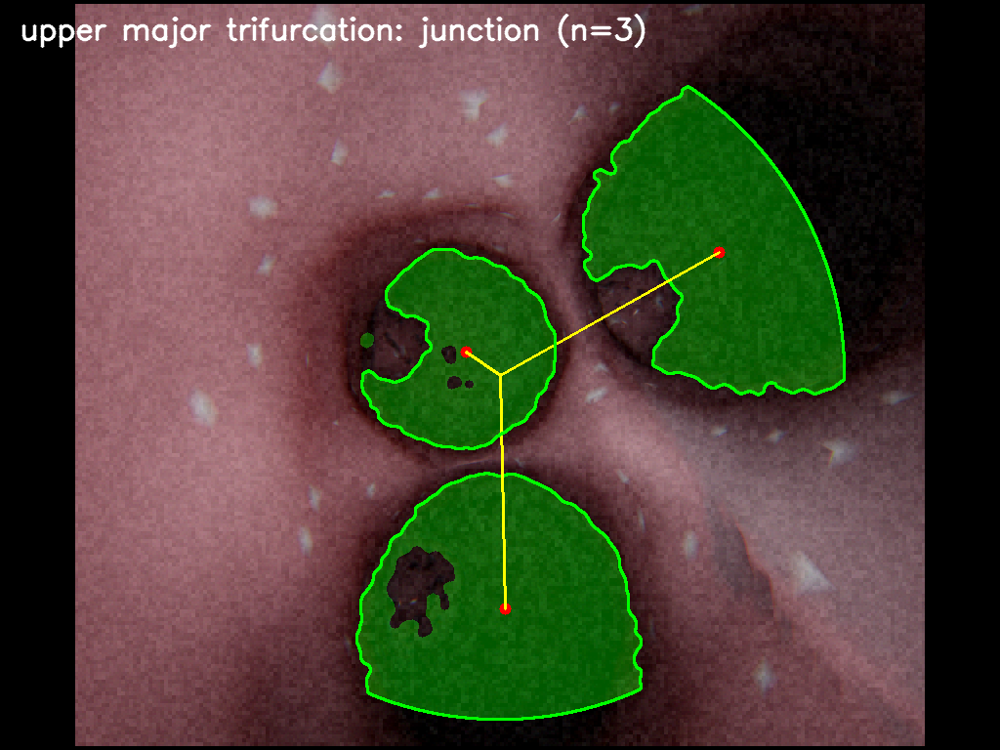 | 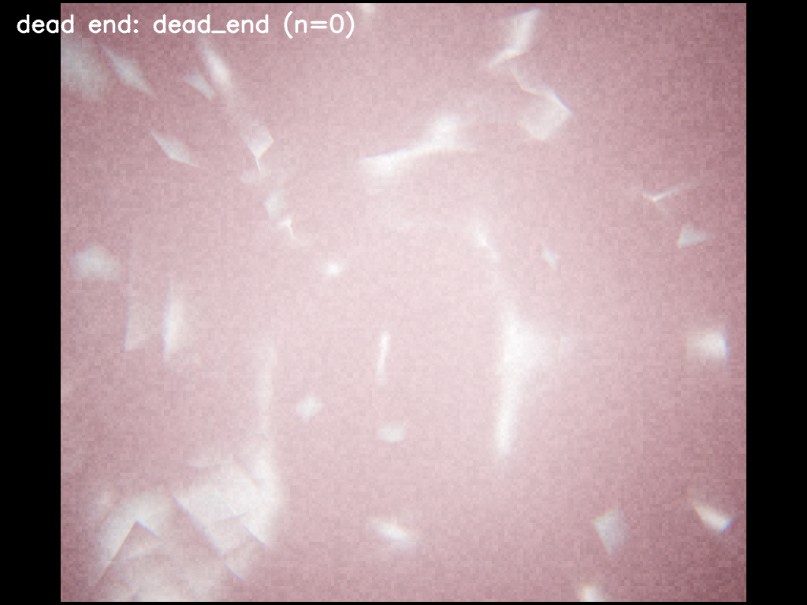 |

Detected dark-blob contours are outlined in green, centroids in red, and the polar steering vectors from frame center are drawn in yellow.

| Blob polar coords vs ground truth | DINOv2+VLAD place-recognition confusion matrix |
|---|---|
| 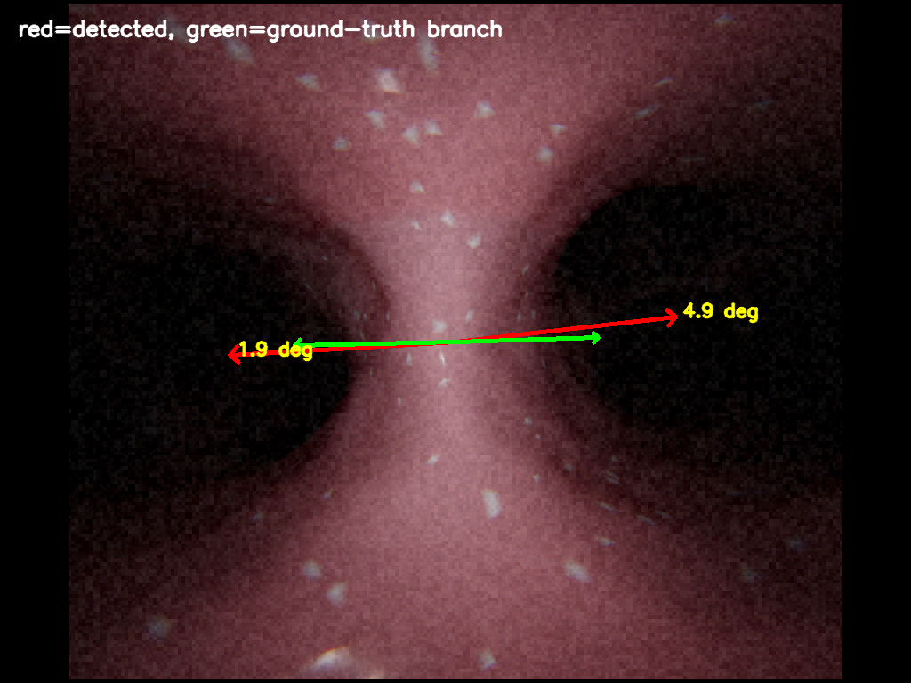 | 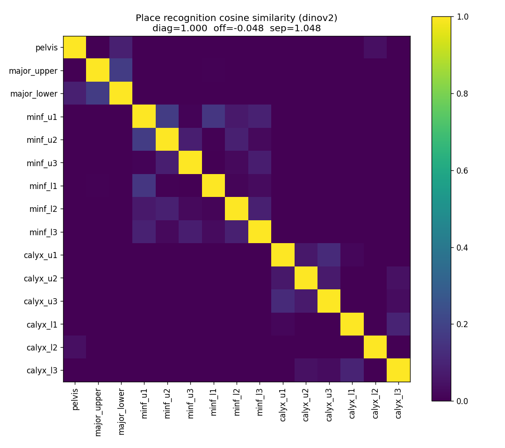 |

Left: at the pelvis bifurcation, detected blob centroids (red arrows) are compared against ground-truth branch directions (green arrows) recovered by projecting the first waypoint of each major calyx into the camera frame. The angular errors of 4.9° and 1.9° are well below the 20° threshold the steering controller will need.

Right: pairwise cosine similarity of DINOv2+VLAD descriptors across all 15 named locations. The diagonal is saturated, the off-diagonal mean is essentially zero (–0.048) — every anatomical location is mapped to a nearly orthogonal descriptor.

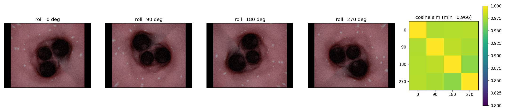

Roll invariance test: same anatomical viewpoint rendered at 0°/90°/180°/270° of cumulative shaft roll. Place recognition de-rotates the frame by `cumulative_roll` and crops to a centered square inscribed in the rotation circle, so the same disc of pixels is sampled at every angle. The four descriptors remain >0.96 cosine similar.

The HSV histogram fallback (no torch) still passes all tests but with much weaker place-recognition separation (~0.13). With DINOv2 the off-diagonal mean is essentially zero — different anatomical locations produce nearly orthogonal descriptors.

## Install

Requires Python 3.10–3.12. Uses [uv](https://docs.astral.sh/uv/) for environment management.

```bash
git clone <this-repo> endonav-sim
cd endonav-sim
uv sync                          # production deps (numpy, opencv, moderngl, ...)
uv sync --extra dev              # + ruff, pytest
uv sync --extra perception-dl    # + torch + torchvision for DINOv2 place recognition
```

## Quickstart

```python
from endonav_sim import KidneySimulator

sim = KidneySimulator()                # builds anatomy, mesh, renderer
sim.reset()                             # camera at ureter entry
out = sim.render()                      # dict: rgb, depth, pose, nearest_wall_mm, current_tree_node, current_tree_progress
sim.command(advance_mm=2.0)                            # push the scope 2 mm deeper
sim.command(roll_deg=90.0, deflection_deg=30.0)        # roll 90°, then deflect tip 30°
# returns False (and reverts state) if the new tip pose collides with the wall
sim.follow_skeleton("calyx_u1", 0.5)    # teleport to a skeleton waypoint
```

## Validation scripts

```bash
uv run python -m scripts.validate_grid               # 3x3 anatomical viewpoint grid
uv run python -m scripts.validate_kinematics         # 3x4 roll/deflection grid + invariants
uv run python -m scripts.validate_junction_detector  # dark-blob detection at all bifurcations
uv run python -m scripts.validate_brightness_falloff # 1/r² falloff plot
uv run python -m scripts.validate_flythrough         # MP4 fly-through of the entire DFS
uv run python -m scripts.visualize_skeleton          # 3D skeleton + mesh point cloud
uv run python -m scripts.validate_perception         # full perception stack (6 tests, 6 PNGs)
```

Outputs are written to the repo root (and gitignored).

## Layout

```
endonav_sim/
  sim/                            Procedural anatomy + rendering pipeline
    tree.py            Sampaio Type A1 anatomy as a dict of segments
    skeleton.py        Walks the tree, builds per-node 1mm-spaced waypoints with tangents
    mesh_gen.py        Implicit swept-sphere field, smooth-min/max, marching cubes
    texture.py         Value-noise displacement, vertex coloring, cribriform, plaque
    collision.py       SDF clearance check (mesh.contains + closest_point)
    renderer.py        moderngl renderer, SSAA, two-pass coaxial + endoscope post
    simulator.py       Public KidneySimulator API
    shader/
      coaxial.{vert,frag}     EndoPBR-style coaxial BRDF
      postprocess.{vert,frag} Letterbox + chroma + h264-style noise resolve
  perception/                     RGB-only perception for autonomous navigation
    junction.py        Adaptive dark-blob detector → junction/lumen/dead_end + polar targets
    place_recognition.py  DINOv2 ViT-S/14 + VLAD (HSV histogram fallback), roll-invariant
    proximity.py       3×3 brightness grid + Farneback optical-flow safety reflex
scripts/
  validate_grid.py
  validate_kinematics.py
  validate_junction_detector.py
  validate_brightness_falloff.py
  validate_flythrough.py
  visualize_skeleton.py
  validate_perception.py
docs/images/         README assets
```

## Dev

```bash
uv run ruff check endonav_sim scripts
uv run ruff format endonav_sim scripts
```

## License

MIT — see [LICENSE](LICENSE).

## References

- **EndoPBR**: Material and Lighting Estimation for Photorealistic Surgical Simulations via Physically-based Rendering. arXiv:2502.20669 (2025). https://arxiv.org/abs/2502.20669
- **Sampaio classification** of pelvicalyceal patterns: Sampaio FJB, *Anatomical background for nephron-sparing surgery in renal cell carcinoma.* J Urol 1992; see [PMC10953598](https://pmc.ncbi.nlm.nih.gov/articles/PMC10953598/) for an endourology-focused narrative review.
- **NVIDIA GPU Gems Ch 16**, Real-Time Approximations to Subsurface Scattering. https://developer.nvidia.com/gpugems/gpugems/part-iii-materials/chapter-16-real-time-approximations-subsurface-scattering
- **Dey et al.**, *Photo-Realistic Tissue Reflectance Modelling for Minimally Invasive Surgical Simulation*, MICCAI 2005.
